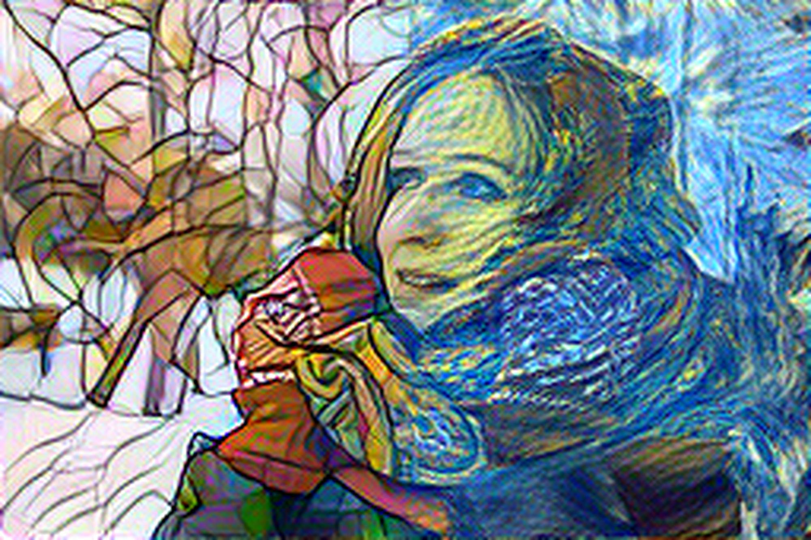
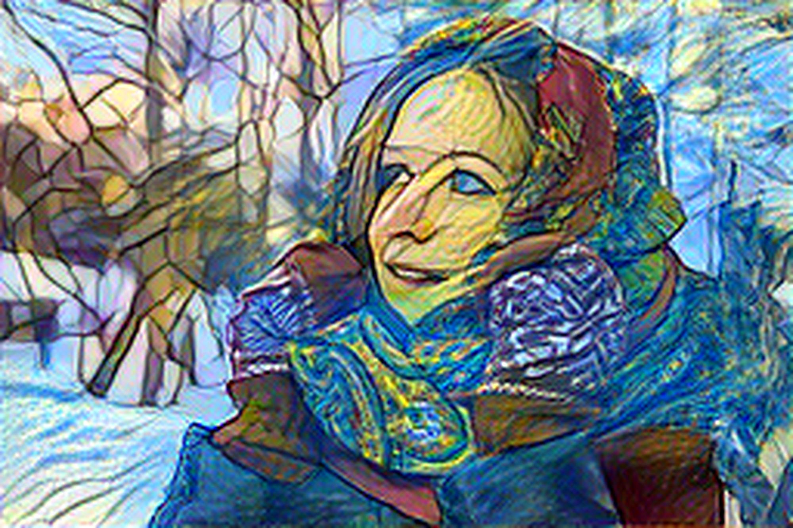

# Neural Style Transfer
PyTorch Implementation of Neural Style Transfer from the paper "A Neural Algorithm of Artistic Style" (http://arxiv.org/abs/1508.06576)

# Examples
## Single Style Transfer

Content Image

	

	
	

	
	

## Masked Style Transfer

	

## Multiple Style Transfer

	

