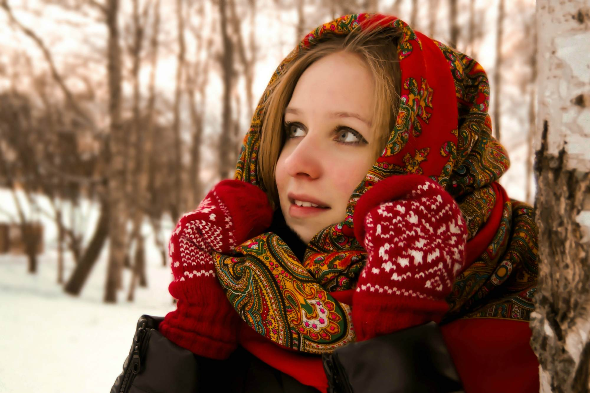
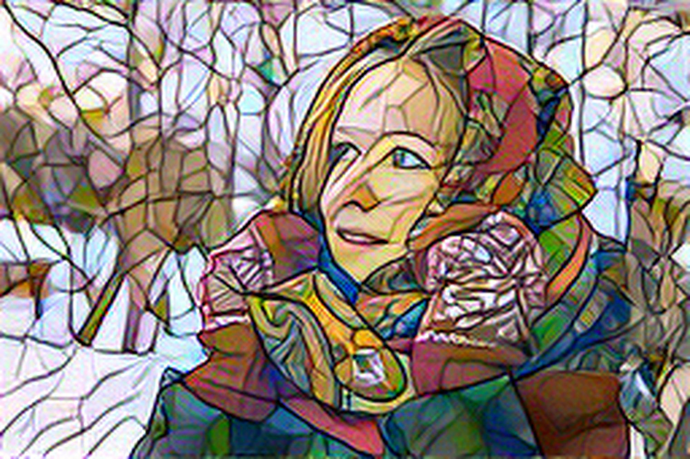
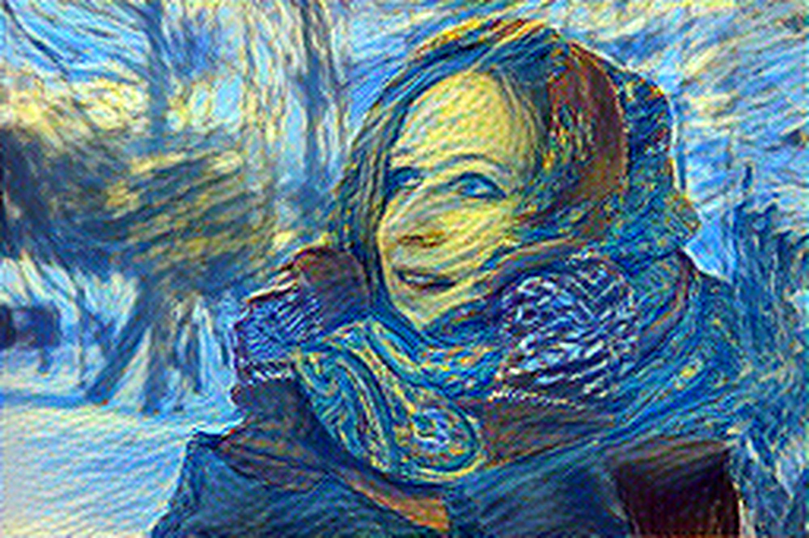

# Neural Style Transfer
PyTorch Implementation of Neural Style Transfer from the paper "A Neural Algorithm of Artistic Style" (http://arxiv.org/abs/1508.06576)

# Examples
## Single Style Transfer
Content Image

  

Style Image

  
  

Style 2 Image

  
  

## Masked Style Transfer

## Multiple Style Transfer
